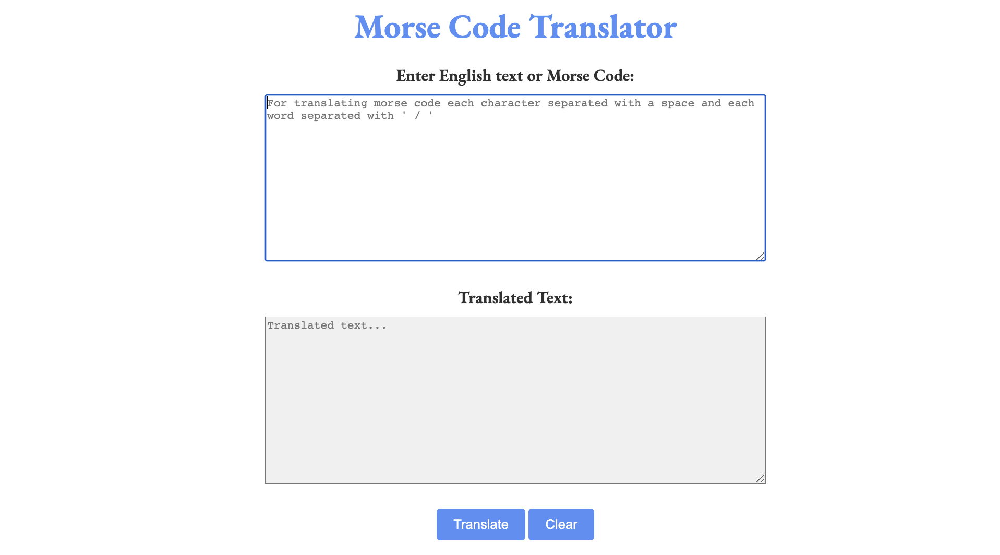

### 👉 [Go to Morse Code Translator](https://amrutas-mct.netlify.app)

## Goals
- Implementing the Javascript topics that I have learned through out the training such as Arrays, Iterators, Document Object Model (DOM), Object, Modules, and Unit Testing.

## MVP
- Create a user interface that allows the user to either input some English text or some Morse Code
- Create JS functions that would allow the user to translate their English text into Morse Code or Morse Code into English text
- Make sure to handle spaces properly (ie. there is 1 space between English words, but one space between Morse Code characters)

